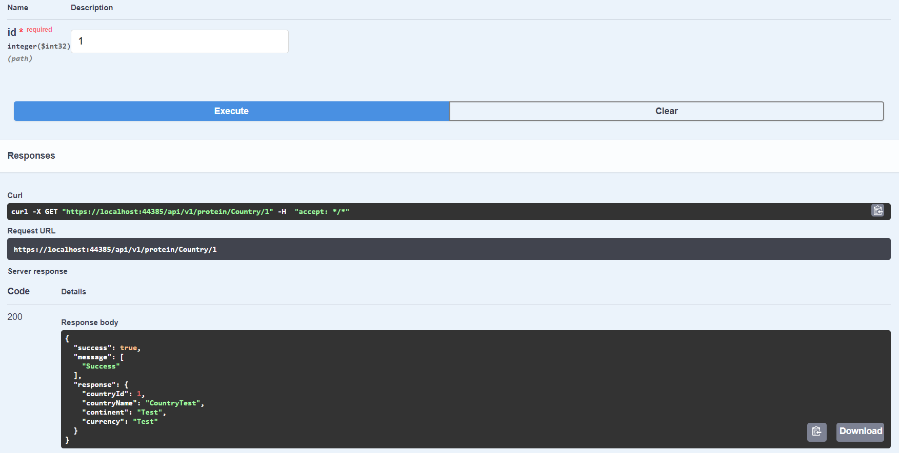

# 2-hafta-odev-gorkemetem

Bu proje databasede bulunan 4 tablonun silme ekleme listeleme gibi fonksiyonlarını WebApi ile gerçekleştiren bir porjedir. Tabloların database bağlantısı entity framework ve dapper framework kullanılarak yazılmıştır. Aşağıda swagger üzerinde yapılan testlerin ekran görüntüleri bulunmaktadır.

PostgreSql bağlantısında hatalar aldığım için database'i sql server'da oluşturdum. 
4 tablo için de istenilenlere uygun şekilde controller'lar ve repository'ler oluşturuldu. Bazı fonksiyonlarda hata almaktayım.

## Ekran Görüntüleri
    Country table:

    Employee table:

    Database:

